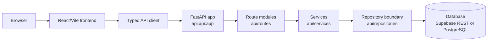
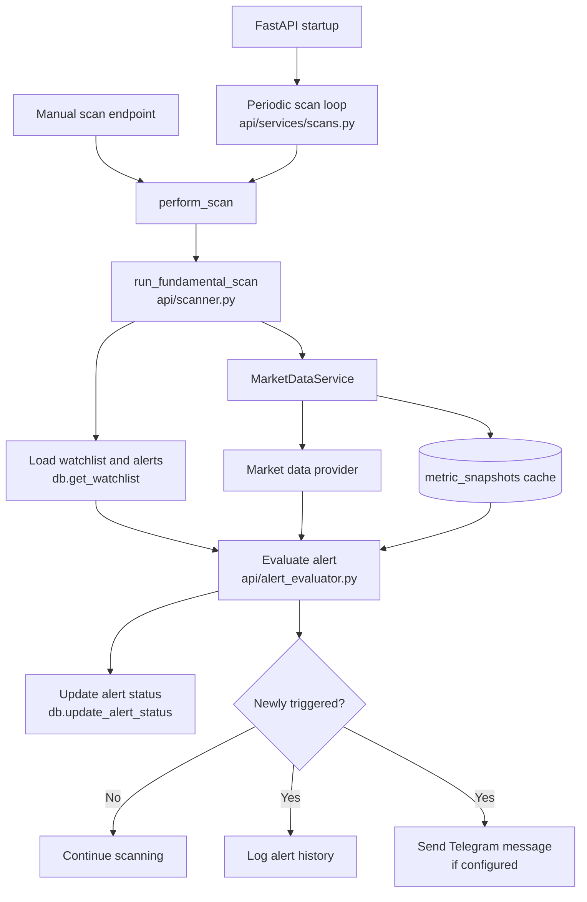
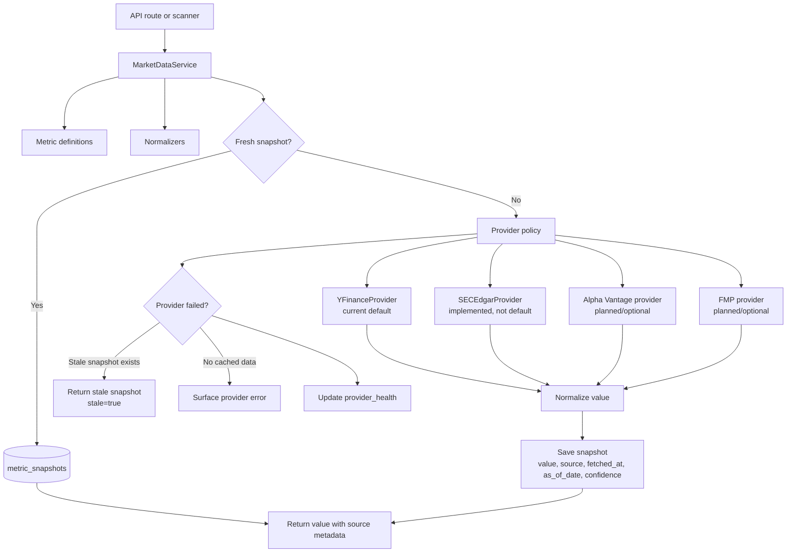

# FundamenTracker Architecture

FundamenTracker is a self-hosted investing tracker with a React/Vite frontend, a
FastAPI backend, repository-style database access, market data snapshots, alert
scanning, optional Telegram notifications, optional Gemini analysis, and local
PostgreSQL or Supabase REST persistence.

The project is moving toward a clearer layered architecture without doing a large
rewrite in one step. The current active entrypoint is `api.api:app`; the main
frontend entrypoint is `frontend/src/App.tsx`.

## Request Flow

The user-facing application should treat the API as the contract boundary. The
frontend should not know whether data is stored in Supabase REST or PostgreSQL.

Important current boundaries:

- `frontend/src/lib/apiClient.ts` is the preferred frontend API access point.
- `api/api.py` configures FastAPI, CORS, auth dependencies, startup tasks, and
  router registration.
- `api/routes/*` owns HTTP-level validation and dependency wiring.
- `api/services/*` owns application behavior where it has already been split out.
- `api/repositories/factory.py` selects the current persistence backend.
- `api/repositories/postgres.py` and `api/repositories/supabase_rest.py` contain
  backend-specific query logic.
- `api/db/client.py` is a compatibility wrapper around the repository factory,
  not the primary implementation file.
- `docker-compose.prod.yml` defaults to `DATABASE_BACKEND=postgres`; a bare
  non-Compose API defaults to `supabase_rest` if `DATABASE_BACKEND` is unset.

## Scanner Flow

The scanner evaluates active alerts against current market data, updates alert
state, logs newly triggered alerts, and optionally sends Telegram notifications.

Scanner behavior and constraints:

- Alerts are evaluated by `alert_id`, which allows multiple alerts for the same
  ticker and metric.
- Primary alert mutations use ID-based routes: `PATCH /alerts/{alert_id}`,
  `DELETE /alerts/{alert_id}`, and `PATCH /alerts/{alert_id}/toggle`.
- Deprecated compatibility routes `PUT /update` and
  `DELETE /remove/{ticker}/{metric}` first resolve exactly one matching alert.
  They return `404` when no alert matches and `409` when multiple alerts match,
  so duplicate ticker+metric alerts cannot be updated or deleted accidentally.
- Relative alerts use the shared formula in `api/alert_evaluator.py`.
- Telegram delivery is optional; missing Telegram settings should not block
  scanning.
- Tests must use fakes or mocks and must not call live market data or Telegram.

## Market Data Service

`MarketDataService` is the abstraction point for quotes, metrics, histories,
provider health, snapshot caching, normalization, stale data fallback, and future
multi-provider selection.

Current state:

- `YFinanceProvider` is the default live provider.
- SEC EDGAR support exists for selected audited US fundamentals and should
  remain provider-isolated. It is implemented and tested, but not automatically
  selected by the default live service.
- Metric snapshots and provider health are stored through the repository
  boundary.
- The service already normalizes symbols and metric values before returning or
  storing data.
- The bootstrap schema includes a `data_providers` table, but current provider
  selection is code-based rather than table-driven.

Target direction:

- Select providers by data type: price, audited fundamentals, statements,
  estimates, and calculated ratios.
- Preserve candidate values when providers disagree significantly.
- Return source, confidence, fetched timestamp, as-of date, and stale status
  wherever practical.
- Keep optional providers failure-tolerant. A missing optional API key should not
  break unrelated data flows.

## Development and Production

Development is optimized for local iteration:

- `docker-compose.dev.yml` starts the API with `uvicorn --reload`.
- The frontend runs the Vite development server.
- Source directories are bind-mounted for fast feedback.
- Local ports default to `8000` for the API and `5173` for the frontend.
- Dev settings may expose more services locally, but should still avoid real
  secrets in committed files.

Production is optimized for self-hosted operation:

- `docker-compose.prod.yml` runs the API without reload.
- Services use `restart: unless-stopped`.
- PostgreSQL data is persisted under `FT_DATA_DIR`, defaulting to
  `/srv/fundamentracker`.
- API, frontend, and pgAdmin bind to `127.0.0.1` by default unless explicitly
  configured otherwise.
- Profiles control optional services such as the frontend, dashboard, and
  Cloudflare Tunnel.
- Healthchecks are used so dependent services can wait for readiness.
- systemd units and watchdog scripts are available for host-level operation.

The production path should remain conservative: avoid destructive defaults, keep
database dashboards private by default, and document any environment variable
that changes exposure or persistence behavior.

## Technical Decisions and Tradeoffs

### FastAPI plus React/Vite

FastAPI provides typed request/response contracts and straightforward dependency
injection. React/Vite keeps the frontend simple and fast to develop. The tradeoff
is that API contracts need discipline: frontend code should use shared client
helpers instead of repeated ad hoc `fetch` calls.

### Repository Boundary

The active persistence boundary is `api/repositories/`. `api/db/client.py`
remains as a compatibility wrapper for older imports. This preserves existing
Supabase REST behavior while supporting local PostgreSQL. The tradeoff is that
there is still duplicated backend-specific query logic, so tests should cover
both repository selection and shared response shapes.

### Supabase REST and Local PostgreSQL

Supporting both backends preserves the original deployment path and enables
self-hosting with local ownership of data. The tradeoff is duplicated query
logic and extra testing responsibility. Business logic should call repository
functions rather than branch on database backend directly.

### Market Data Snapshots

Snapshots make market data more auditable and resilient. They allow stale
fallbacks when a provider fails and record source metadata for later inspection.
The tradeoff is storage growth and cache invalidation complexity. TTLs should be
explicit by data type, and stale responses should be visibly marked.

### Provider Abstraction

Provider classes keep external data calls out of routes and scanner logic. This
supports tests with fake providers and makes it possible to add SEC EDGAR, Alpha
Vantage, or FMP without coupling the UI to provider details. The tradeoff is that
provider disagreements must be modeled deliberately instead of hidden behind one
float value.

### Background Scanner in the API Process

The current scanner runs from FastAPI startup and manual scan endpoints. This is
simple to operate for a self-hosted app. The tradeoff is that background work
shares lifecycle and resources with the API process. If scanning grows heavier,
it may deserve a separate worker service or scheduled job.

### Telegram as Optional Notification Transport

Telegram is useful for personal alerts and can be disabled by omitting token or
chat settings. The tradeoff is operational sensitivity around bot tokens and chat
IDs. Secrets must stay in environment variables, and tests must not call the live
Telegram API.

### Docker Compose Split

Separate dev and prod compose files keep hot-reload convenience away from
production operation. The tradeoff is documentation overhead. Any deployment
change should update the relevant docs and keep copy-pasteable commands current.

### AI Valuation as a Service

AI valuation should stay behind a service that builds an explicit data pack,
tracks sources, and returns structured output with warnings and a disclaimer.
The current code has moved the Gemini call into `api/services/valuation.py`, but
the response is still plain text shaped as `{"analysis": "..."}`. Structured
output with explicit warnings, sources, confidence, and disclaimer fields is
planned but not implemented yet.
